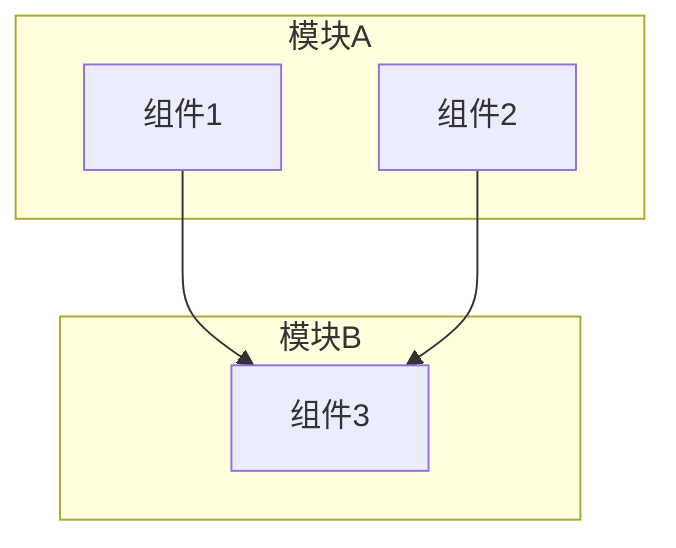
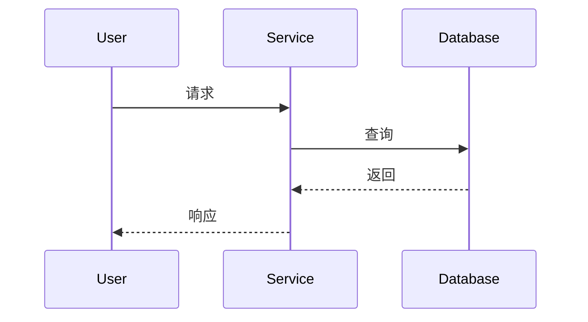

# 技术方案设计

**项目名称**: [项目名称]
**作者**: [作者]
**版本**: v1.0
**日期**: [日期]
**状态**: 草稿 / 评审中 / 已通过

---

## 术语表

> 如无特殊术语可删除此章节

| 术语 | 解释 |
|------|------|
| [术语] | [解释] |

---

## 一、背景

### 1.1 问题描述

> 当前遇到什么问题？为什么需要解决？

### 1.2 业务场景

> 在什么场景下会触发这个问题？影响范围是什么？

---

## 二、目标

### 2.1 核心目标

> 本方案要达成的核心目标，需可衡量

- 目标1: [具体描述，包含衡量指标]
- 目标2: [具体描述，包含衡量指标]

### 2.2 非目标

> 明确不在本次范围内的内容

- [明确不做的事项]

---

## 三、方案

### 3.1 方案概述

> 用一段话概括整体方案思路

### 3.2 整体架构

> 展示系统/模块的整体架构



### 3.3 业务流程

> 核心业务流程的时序图



### 3.4 方案对比

> 如有多个可选方案，进行对比分析

| 维度 | 方案A | 方案B |
|------|-------|-------|
| 描述 | [简述] | [简述] |
| 优点 | [优点] | [优点] |
| 缺点 | [缺点] | [缺点] |
| 复杂度 | 低/中/高 | 低/中/高 |

**推荐方案**: [方案X]

**推荐理由**: [说明为什么选择该方案]

---

## 四、核心模块设计

### 4.1 [模块名称]

**职责**: [一句话说明职责]

**核心逻辑**:
- [逻辑点1]
- [逻辑点2]

**接口定义**:
```typescript
// 示例接口
interface Example {
  id: string;
  name: string;
}
```

### 4.2 [模块名称]

> 按需添加更多模块

---

## 五、风险与应对

| 风险 | 影响 | 概率 | 应对措施 |
|------|------|------|----------|
| [风险描述] | 高/中/低 | 高/中/低 | [应对方案] |

---

## 六、排期

> 可选章节，如需要可列出里程碑

| 阶段 | 内容 | 交付物 |
|------|------|--------|
| Phase 1 | [内容] | [交付物] |
| Phase 2 | [内容] | [交付物] |

---

## 七、附录

### 参考资料

- [相关文档或链接]

### 变更记录

| 版本 | 日期 | 作者 | 变更内容 |
|------|------|------|----------|
| v1.0 | [日期] | [作者] | 初稿 |
