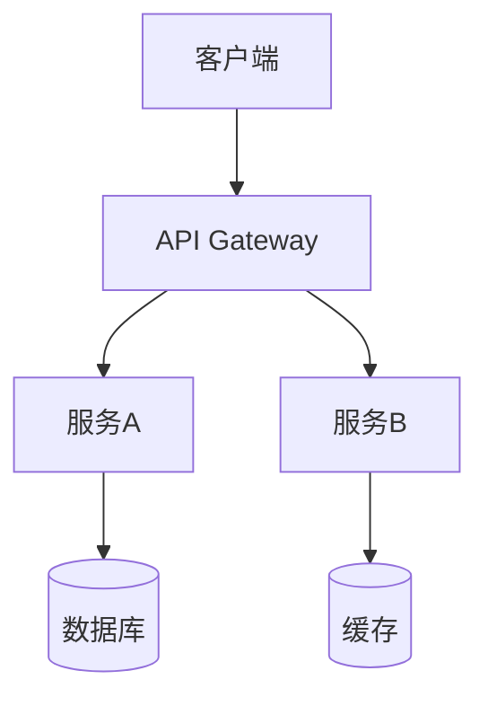
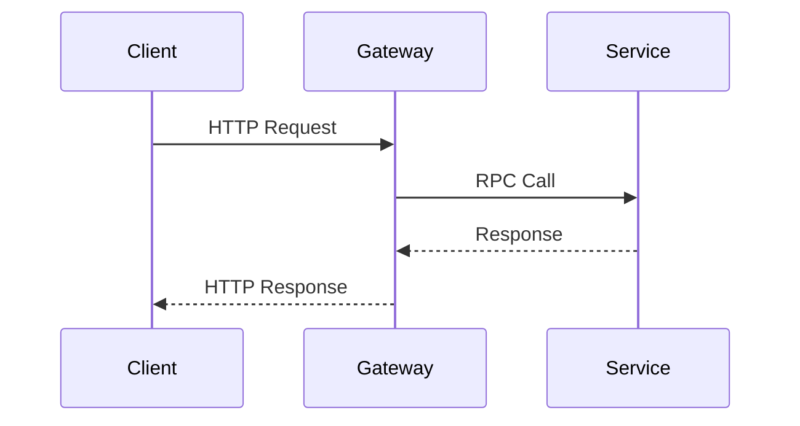
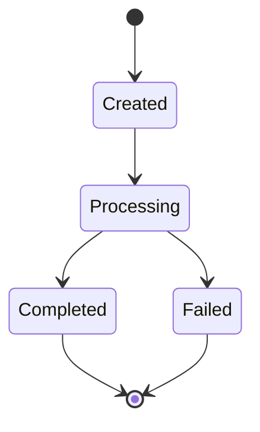

# 技术方案设计参考

## 常见架构模式

### 1. 分层架构

**适用**: 传统 Web 应用、CRUD 系统

```
表现层 → 业务层 → 数据层
```

**优点**: 结构清晰、易于理解
**缺点**: 层间耦合、变更影响大

### 2. 微服务架构

**适用**: 大型系统、需独立部署扩展

**优点**: 独立部署、技术栈灵活、故障隔离
**缺点**: 运维复杂、分布式事务难处理

### 3. 事件驱动架构

**适用**: 高并发、异步处理、松耦合系统

**优点**: 高解耦、易扩展
**缺点**: 调试困难、一致性复杂

### 4. 六边形架构

**适用**: 复杂业务领域、需要高可测试性

**优点**: 业务逻辑独立、易于测试
**缺点**: 学习曲线陡、代码量增加

## 选型建议

| 场景 | 推荐架构 |
|------|----------|
| 小型项目/MVP | 分层架构 |
| 大型复杂系统 | 微服务 |
| 高并发异步 | 事件驱动 |
| 复杂业务逻辑 | 六边形/DDD |

## Mermaid 图表示例

### 架构图



### 时序图



### 状态图



## 文档编写要点

1. **背景要具体** - 说清楚问题和影响
2. **目标要可衡量** - 避免模糊描述
3. **方案要可执行** - 细化到可实现
4. **风险要识别** - 提前准备应对
5. **图表要清晰** - 一图胜千言
