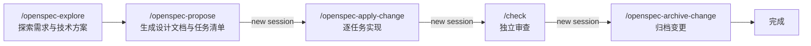

<p align="center">
  
</p>

<h1 align="center">dotfiles</h1>

<p align="center">
  <strong>一行命令部署开发环境与 AI 编码工作流</strong>
</p>

<p align="center">
  
  
  
  
</p>

---

## 这是什么

三个独立模块，可按需组合：

- **🛠️ 工具链**：[mise](https://mise.jdx.dev) 统一管理 6 个 runtime(Node LTS / Bun / Go / Python 3.14 / Java 21 / uv)与 20+ CLI 工具，含 Claude Code、Codex、pi、OpenSpec 等 AI 命令行
- **🐚 Shell 配置**：[chezmoi](https://chezmoi.io) 部署手写 Zsh 配置 + Git(delta diff)+ Starship prompt，启动 P50 < 60ms
- **🤖 Agent 配置**：以 `AGENTS.md` 行为规范为核心，搭配 29 个 Agent Skills + MCP 配置，覆盖探索、设计、实现、审查全流程

支持 macOS 和 Linux(包括 root 环境)，完全幂等(重复运行无副作用)。

## 快速开始

### 完整安装(新机器推荐)

```bash
curl -fsSL https://raw.githubusercontent.com/OiAnthony/dotfiles/main/install.sh | bash
```

安装完成后：

1. **重启终端**或运行 `exec zsh` 加载新配置
2. 运行 `mise doctor` 验证工具链
3. 运行 `benchmark-zsh` 检查 Shell 性能(可选)

<details>
<summary><strong>模块化安装</strong>(已有环境，只装需要的部分)</summary>

在 `bash -s --` 后追加模块 flag，可自由组合：

```bash
curl -fsSL https://raw.githubusercontent.com/OiAnthony/dotfiles/main/install.sh | bash -s -- --agents --shell
```

| Flag | 部署内容 | 适用场景 |
|------|---------|----------|
| `--agents` | `.agents/` → `~/.agents`：`AGENTS.md`、Skills、`mcp.json` | 只要 AI 编码工作流，不动现有环境 |
| `--tools` | `mise.toml` → `~/.config/mise/config.toml` 并安装全部工具 | 统一管理开发工具，保留现有 Shell |
| `--shell` | Zsh + Git + Starship 配置(chezmoi 部署) | 只要 Shell 配置，不装额外工具 |

模块间无硬性依赖。`--agents` 需配合支持 Skills 的 AI 工具(如 pi、Claude Code)。

</details>

## AI 工作流

`.agents/` 目录软链到 `~/.agents`，对机器上所有项目生效。

### `AGENTS.md` — 行为规范

整套工作流的灵魂。它不是文档，而是约束 AI 如何工作的规则集，与项目自身的 `AGENTS.md` 叠加：

| 规范 | 约束什么 |
|------|---------|
| Think Before Coding | 先说假设、暴露分歧、不懂就问，禁止闷头动手 |
| Simplicity First | YAGNI / KISS，拒绝投机式抽象和过度设计 |
| Surgical Changes | 只改必要的行，不顺手「优化」无关代码 |
| Goal-Driven Execution | 把任务转成可验证目标，循环到验证通过 |
| Learn from Corrections | 被纠正后写回项目 `AGENTS.md`，同一错误不犯两次 |
| Language | 对话用中文，代码/commit/PR 用英文 |

检验标准写在文件末尾：diff 里无关改动更少、因过度设计返工更少、澄清问题出现在动手前而非犯错后。

`CLAUDE.md` 软链到 `AGENTS.md`，供读取该文件名的工具使用，单一数据源。

### 任务流程

**轻量任务**(单次对话完成)

```
/think → implement this plan → /check
/hunt → fix it → /check
```

**复杂任务**(OpenSpec)



分阶段开新 session 是有意设计：`/check` 在新 session 审查，避开实现阶段的惯性思维。

## 装了什么

### 工具链(mise 管理)

**Shell 体验**

- starship(极简 prompt)、fzf(fuzzy finder)、zoxide(智能跳转)
- fd(文件查找)、ripgrep(内容搜索)、jq(JSON 处理)
- neovim、yazi(终端文件管理器)

**Git 工具**

- gh(GitHub CLI)、lazygit(TUI)、git-delta(增强 diff)

**Runtime**

- Node.js LTS、Go latest、Python 3.14、Java 21、uv(Python package manager)
- Bun + pnpm

**AI 开发**

- Claude Code、Codex、opencode、pi(+ oh-my-pi)、herdr
- agent-browser(浏览器自动化)、OpenSpec(Spec-Driven Development)

### Shell 配置(chezmoi 部署)

手写的 Zsh 配置，无 Oh My Zsh 框架：

- `~/.zshrc`(用户自定义，不受 chezmoi 管理)
- `~/.config/zsh/core.zsh`(核心配置：alias、completion、fzf lazy loading)
- `~/.gitconfig`(delta diff、自定义 alias)
- `~/.config/starship.toml`(prompt 主题)
- zsh-autosuggestions + fast-syntax-highlighting plugin

## 日常使用

### 基础操作

```bash
# 预览配置变更
chezmoi diff --exclude scripts

# 应用配置(会重新生成 Shell 集成脚本和 completion cache)
chezmoi apply

# 更新工具链
mise install
mise upgrade

# 进入仓库目录
chezmoi cd
```

## 自定义

### 添加新工具

使用 `mise use -g` 自动安装并写入 `mise.toml`，优先使用 `aqua:` 或 `ubi:` backend：

```bash
mise use -g aqua:sharkdp/bat
mise use -g ubi:BurntSushi/ripgrep
```

也可以手动编辑 `mise.toml` 后运行 `mise install`。

### 修改 Shell 配置

**用户自定义**(推荐)

直接编辑 `~/.zshrc`，添加环境变量、alias 或第三方工具初始化。此文件不受 chezmoi 管理。

**修改核心配置**

使用 chezmoi 工作流：

```bash
chezmoi edit ~/.config/zsh/core.zsh
chezmoi diff --exclude scripts
chezmoi apply
```

### 添加新 Skill

```bash
bunx skills add <owner/repo>
```

浏览更多 skills：[skills.sh](https://skills.sh/)

## 故障排查

### Shell 启动慢

运行性能基准测试：

```bash
benchmark-zsh
```

目标：P50 < 60ms，P95 < 100ms。若超标，检查 `~/.zshrc` 中是否有重量级初始化调用。

### mise 工具找不到

```bash
# 诊断工具链状态
mise doctor

# 重新安装所有工具
mise install

# 验证特定工具
mise which node
```

### chezmoi 配置冲突

```bash
# 查看冲突内容
chezmoi diff

# 强制覆盖本地修改
chezmoi apply --force

# 手动合并冲突
chezmoi merge ~/.config/zsh/core.zsh
```

### 环境变量或 secret 管理

**不要将 secret 提交到仓库**。机器本地配置应放在：

```bash
~/.config/zsh/private/env.zsh  # 权限 600
```

此文件会被自动加载，但不受版本控制。

## 开发与测试

### 运行测试

```bash
make lint            # shellcheck 静态检查
make test            # Docker 容器集成测试
make test-idempotent # 幂等性验证
make test-root       # root 用户路径测试
make test-rtk-migration # RTK 工具升级 migration 测试
make test-all        # 运行全部 test suite
```

### 本地验证

```bash
# 非交互式安装(CI 模式)
CI=true ./install.sh

# 模拟安装(不执行实际部署)
DOTFILES_NO_EXEC=1 ./install.sh
```

## 进阶文档

- [Zsh 性能优化指南](docs/zsh-optimization.md)
- [测试说明](docs/testing.md)

<details>
<summary>目录结构速览</summary>

```
dotfiles/
├── install.sh                   # 安装入口(--tools/--shell/--agents)
├── mise.toml                    # 工具链 manifest
├── .agents/                     # AI 配置(→ ~/.agents)
│   ├── AGENTS.md                # 全局 Agent 行为规范(核心)
│   ├── skills/                  # Agent Skills
│   └── mcp.json                 # MCP 服务器配置
├── .chezmoi.toml.tmpl           # chezmoi 主配置
├── .chezmoiexternal.toml        # 外部依赖(Zsh 插件)
├── .chezmoiscripts/             # 部署后脚本
│   └── run_after_*.sh.tmpl      # 生成 Shell 集成与 completion cache
├── dot_zshrc / dot_zshenv       # Zsh 入口(部署到 ~/)
├── dot_gitconfig                # Git 配置
├── dot_config/                  # 映射到 ~/.config/
│   ├── starship.toml            # Prompt 主题
│   └── zsh/core.zsh             # 核心 Shell 配置
├── Makefile / Dockerfile        # 测试基础设施
├── scripts/                     # 测试与基准脚本
└── docs/                        # 进阶文档
```

</details>

## 致谢

- [mise](https://github.com/jdx/mise) — 工具链管理
- [chezmoi](https://github.com/twpayne/chezmoi) — dotfiles 管理
- [starship](https://github.com/starship/starship) — Shell prompt
- [Waza](https://github.com/tw93/Waza) — AI skill 系列
- [OpenSpec](https://github.com/Fission-AI/OpenSpec) — 规范驱动开发工作流

## License

MIT
