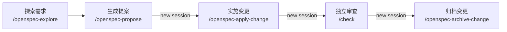

<p align="center">
  
</p>

<h1 align="center">dotfiles</h1>

<p align="center">
  一次部署开发工具、Zsh 环境和 Coding Agent 工作流。
</p>

<p align="center">
  
  
  
</p>

## 这个仓库解决什么问题

新机器的开发环境通常分散在多套工具和配置里：语言运行时各自安装，Shell 体验依赖手工复制，Claude Code、Codex、pi 等 Coding Agent 又各自维护规则和 Skill。这个仓库把它们收敛成一套可重复执行的配置。

全量安装后会得到三个相互独立的模块：

| 模块 | 安装后的效果 |
| --- | --- |
| 开发工具 | [mise](https://mise.jdx.dev/) 统一管理 Node.js、Bun、Go、Python、Java、常用 CLI 和 AI 开发工具 |
| Shell | [chezmoi](https://www.chezmoi.io/) 部署 Zsh、Git、Starship、补全和插件配置，同时保留机器专属配置入口 |
| Coding Agent | `~/.agents` 统一提供 `AGENTS.md`、Agent Skills、命令和 MCP 配置，再同步到支持的 AI 客户端 |

安装脚本支持重复执行。macOS 需要使用普通用户，Linux 同时支持普通用户和 `root`。

## 快速开始

### 全量安装

适合新机器，一次安装开发工具、Shell 和 Coding Agent 配置：

```bash
curl -fsSL https://raw.githubusercontent.com/OiAnthony/dotfiles/main/install.sh | bash
```

安装完成后运行：

```bash
exec zsh
mise doctor
```

如果脚本新建了 `~/.gitconfig`，首次使用 Git 前还需要替换其中的占位用户名和邮箱。

### 仅安装 Agents 模块

适合已有开发环境，只复用 Coding Agent 工作流：

```bash
curl -fsSL https://raw.githubusercontent.com/OiAnthony/dotfiles/main/install.sh | bash -s -- --agents
```

该命令会把仓库的 `.agents/` 链接到 `~/.agents`。如果环境中已有 `bunx`，还会通过 dotagents 同步到支持的 AI 客户端；没有 `bunx` 时只跳过客户端同步，不影响 `~/.agents` 软链接。

模块组合、平台行为和已有配置的处理方式参见[安装与模块说明](docs/installation.md)。

## Coding Agent 工作流

`.agents/AGENTS.md` 是工作流的基础：它约束 Agent 如何确定范围、收集证据、实施修改、验证结果和汇报结论。全局规则会与项目自己的 `AGENTS.md` 叠加，项目规则负责补充当前代码库的技术和业务边界。

`.agents/skills/` 在此基础上提供面向具体任务的工作流：

- `/think`：在编码前澄清需求、权衡方案并形成可执行计划；
- `/hunt`：从复现和证据出发定位故障根因；
- `/check`：独立审查改动、发布条件或项目状态；
- `/openspec-*`：管理需要设计、任务拆分和归档的复杂变更。

### 轻量任务

一次会话能够完成的问题，先确定方案或根因，再实现并审查：

```text
/think → implement this plan → /check
/hunt  → fix it              → /check
```

### 复杂变更

需要设计文档和可追踪任务时，使用 OpenSpec 串联探索、提案、实现、审查和归档：



实现、审查和归档建议使用独立 session，减少实现上下文对审查判断的影响。

## 按需查阅

- [安装与模块说明](docs/installation.md)：模块组合、平台差异、配置保护和非交互安装。
- [工具链管理](docs/toolchain.md)：工具清单、安装、升级和故障排查。
- [Shell 配置与性能](docs/zsh-optimization.md)：启动路径、自定义方式和性能目标。
- [Agents 配置说明](.agents/README.md)：目录结构、客户端同步和修改约定。
- [测试架构说明](docs/testing.md)：Makefile 命令、容器测试范围和调试方法。

## License

[MIT](LICENSE)
